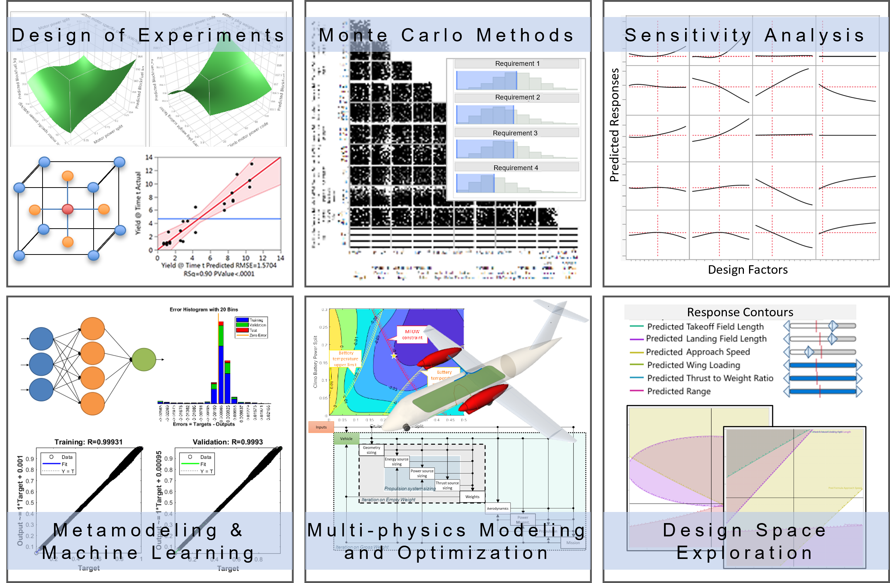

**I**ntegrated **D**esign of **E**nvironmentally-friendly **A**erospace **S**ystems 

Research at IDEAS Lab aims to bring a **holistic approach** that accounts for the **system-level and life-cycle** impact of greenhouse gas emissions in the **design and operation of novel aircraft concepts**. We explore the **new aircraft design space** created by **revolutionary aerospace technologies** to **maximize the environmental and operational benefits** through the use of **physics-based modeling, probabilistic design methods** and **integrated systems engineering** approaches.

### Current research topics include:
- Aerospace systems design, integration, optimization
- Sustainable aviation with a special focus on electrified and hydrogen-powered aircraft concepts
- Statistical and probabilistic design methods
- Surrogate modeling and machine learning
- Model-based systems engineering

